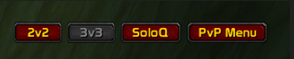
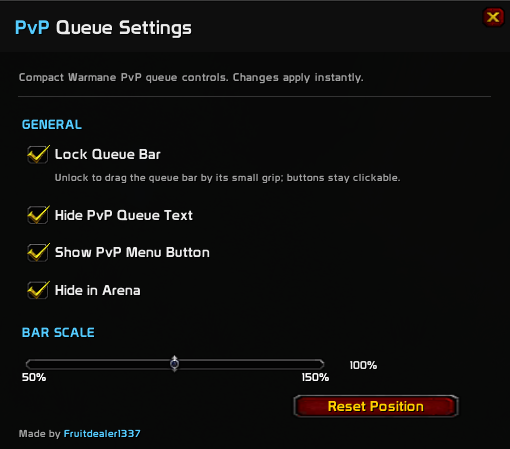

# PvP Queue

PvP Queue is a lightweight queue frontend for **Warmane WoW 3.3.5a**.

It adds a small movable bar with quick access to **2v2**, **3v3**, **SoloQ**, and Warmane's full **PvP Menu**.

The addon does not recreate Warmane's queue system or send its own queue requests. It uses Warmane's own injected PvP Queue buttons after the server initializes them, with a small background warmup system to keep queueing reliable after arena and world transitions.

> **This addon works only on Warmane servers.**

---

## Preview

### Queue Bar



### Configuration



---

## Main Features

- Quick 2v2, 3v3 and SoloQ queue buttons that gets clickable depending on PvP Menu state
- Direct access to Warmane's full PvP Menu
- Automatic silent queue-menu warm-up after arena/world transitions


---

## How to Use

# **IMPORTANT: YOU MUST TALK TO THE WARMANE PvP QUEUE NPC AFTER EVERY FRESH LOGIN OR /RELOAD.**

Warmane creates the custom PvP Queue interface only after you physically interact with the PvP Queue NPC. Until that happens, PvP Queue cannot access Warmane's queue controls and the queue buttons will remain unavailable.

After talking to the NPC once, the addon handles the rest for the current login/reload session.

Open the settings with:

```text
/pvpq
```

You can also open the settings from:

```text
Interface → AddOns → PvP Queue
```

---

## Installation

1. Download the latest release.
2. Extract the archive.
3. Place the `PvPQueue` folder into:

```text
World of Warcraft/Interface/AddOns/
```

4. **Talk to the Warmane PvP Queue NPC.**
5. Queue from the floating bar.

---

## Compatibility

**Warmane only.**

PvP Queue depends on Warmane's custom server-injected PvP Queue interface and is not intended for other 3.3.5a servers.

---

Made by **Fruitdealer1337**
